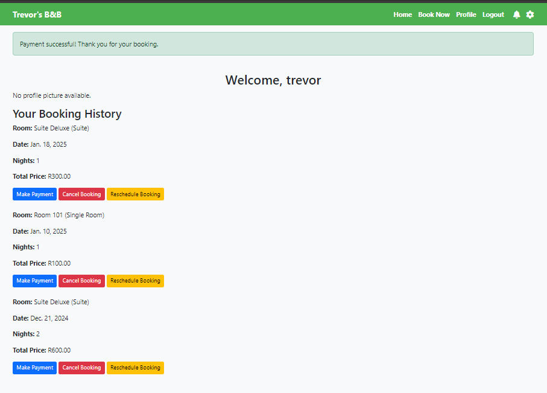

# Booking System

A fully functional Django-based booking system that allows users to book rooms, manage bookings, and handle payments with ease. This project includes user authentication, profile management, and payment simulation features.

---

## Table of Contents

1. [Project Description](#project-description)
2. [Features](#features)
3. [Installation](#installation)
4. [Usage](#usage)
5. [Screenshots](#screenshots)
6. [Technologies Used](#technologies-used)
7. [Documentation](#documentation)
8. [Credits](#credits)
9. [License](#license)

---

## Project Description

This Django Booking System provides a complete solution for users to book rooms at a facility. It includes an easy-to-use interface for users to register, log in, view available rooms, make bookings, cancel or reschedule bookings, and handle payments using a simulated payment system.

---

## Features

- **User Registration and Authentication**: Users can create an account, log in, and manage their profiles.
- **Room Booking**: Users can select from different types of rooms and book them for specific dates.
- **Manage Bookings**: Users can view their bookings, cancel them, or reschedule for another date.
- **Payment Simulation**: A simple payment form to simulate the payment process.
- **Profile Management**: Users can view their booking history and manage their account.
- **Responsive UI**: Built using Bootstrap for a responsive and clean user interface.
- **Sphinx Documentation**: Comprehensive project documentation generated using Sphinx.

---

## Installation

Follow these steps to set up the project on your local machine:

1. **Clone the Repository**:
   ```bash
   git clone https://github.com/TrevorNkunaDeveloper/Capstone_Project.git
   cd Capstone_Project
   ```
2. **Create a Virtual Environment**:
   ```bash
   python -m venv venv
   source venv/bin/activate  # On Windows use: venv\Scripts\activate
   ```

3. **Install Dependencies**:
   ```bash
   pip install -r requirements.txt
   ```

4. **Apply Migrations**:
   ```bash
   python manage.py makemigrations
   python manage.py migrate
   ```

5. **Run the Server**:
   ```bash
   python manage.py runserver
   ```

6. **Using Docker (Optional)**:
   - To build and run the application using Docker, use the following commands:
     ```bash
     # Build the Docker image
     docker build -t booking-system .

     # Run the Docker container
     docker run -p 8000:8000 booking-system
     ```

---

## Usage
1. Register a new user account or log in with an existing account.
2. Navigate to the Booking Page to select a room and make a booking.
3. Go to the Profile Page to view your booking history.
4. Cancel or Reschedule any existing bookings.
5. Complete the booking process by simulating a Payment.

---

## Screenshots
### Booking Page


### Cancel Booking Page


### Confirm Booking Page


### Home Page


### Payment Page


### Payment Success Page


### Reschedule Booking Page


---

## Technologies Used
- **Django**: Web framework for building the backend.
- **Django REST Framework**: For building RESTful APIs.
- **SQLite**: Database used for development.
- **Bootstrap**: Used for responsive and clean UI design.
- **Sphinx**: For generating project documentation.
- **Docker**: For containerization and deployment.
- **Gunicorn**: WSGI server for deployment.
- **Whitenoise**: For serving static files in production.

---

## Documentation
The full project documentation is generated using Sphinx. 
You can view it by opening the index.html file in the docs/build directory.

---

## Credits
This project was developed by Trevor Nkuna. Special thanks to the Django, Bootstrap, and Docker communities for their valuable resources and support.

---

## License
This project is fully open source and available for use for free.
# Booking System

A fully functional Django-based booking system that allows users to book rooms, manage bookings, and handle payments with ease. This project includes user authentication, profile management, and payment simulation features.

---

## Table of Contents

1. [Project Description](#project-description)
2. [Features](#features)
3. [Installation](#installation)
4. [Usage](#usage)
5. [Screenshots](#screenshots)
6. [Technologies Used](#technologies-used)
7. [Documentation](#documentation)
8. [Credits](#credits)
9. [License](#license)

---

## Project Description

This Django Booking System provides a complete solution for users to book rooms at a facility. It includes an easy-to-use interface for users to register, log in, view available rooms, make bookings, cancel or reschedule bookings, and handle payments using a simulated payment system.

---

## Features

- **User Registration and Authentication**: Users can create an account, log in, and manage their profiles.
- **Room Booking**: Users can select from different types of rooms and book them for specific dates.
- **Manage Bookings**: Users can view their bookings, cancel them, or reschedule for another date.
- **Payment Simulation**: A simple payment form to simulate the payment process.
- **Profile Management**: Users can view their booking history and manage their account.
- **Responsive UI**: Built using Bootstrap for a responsive and clean user interface.
- **Sphinx Documentation**: Comprehensive project documentation generated using Sphinx.

---

## Installation

Follow these steps to set up the project on your local machine:

1. **Clone the Repository**:
   ```bash
   git clone https://github.com/TrevorNkunaDeveloper/Capstone_Project.git
   cd Capstone_Project
   ```
2. **Create a Virtual Environment**:
   ```bash
   python -m venv venv
   source venv/bin/activate  # On Windows use: venv\Scripts\activate
   ```

3. **Install Dependencies**:
   ```bash
   pip install -r requirements.txt
   ```

4. **Apply Migrations**:
   ```bash
   python manage.py makemigrations
   python manage.py migrate
   ```

5. **Run the Server**:
   ```bash
   python manage.py runserver
   ```

6. **Using Docker (Optional)**:
   - To build and run the application using Docker, use the following commands:
     ```bash
     # Build the Docker image
     docker build -t booking-system .

     # Run the Docker container
     docker run -p 8000:8000 booking-system
     ```

---

## Usage
1. Register a new user account or log in with an existing account.
2. Navigate to the Booking Page to select a room and make a booking.
3. Go to the Profile Page to view your booking history.
4. Cancel or Reschedule any existing bookings.
5. Complete the booking process by simulating a Payment.

---

## Screenshots
### Booking Page


### Cancel Booking Page


### Confirm Booking Page


### Home Page


### Payment Page


### Payment Success Page


### Reschedule Booking Page


---

## Technologies Used
- **Django**: Web framework for building the backend.
- **Django REST Framework**: For building RESTful APIs.
- **SQLite**: Database used for development.
- **Bootstrap**: Used for responsive and clean UI design.
- **Sphinx**: For generating project documentation.
- **Docker**: For containerization and deployment.
- **Gunicorn**: WSGI server for deployment.
- **Whitenoise**: For serving static files in production.

---

## Documentation
The full project documentation is generated using Sphinx. 
You can view it by opening the index.html file in the docs/build directory.

---

## Credits
This project was developed by Trevor Nkuna. Special thanks to the Django, Bootstrap, and Docker communities for their valuable resources and support.

---

## License
This project is fully open source and available for use for free.
# Booking System

A fully functional Django-based booking system that allows users to book rooms, manage bookings, and handle payments with ease. This project includes user authentication, profile management, and payment simulation features.

---

## Table of Contents

1. [Project Description](#project-description)
2. [Features](#features)
3. [Installation](#installation)
4. [Usage](#usage)
5. [Screenshots](#screenshots)
6. [Technologies Used](#technologies-used)
7. [Documentation](#documentation)
8. [Credits](#credits)
9. [License](#license)

---

## Project Description

This Django Booking System provides a complete solution for users to book rooms at a facility. It includes an easy-to-use interface for users to register, log in, view available rooms, make bookings, cancel or reschedule bookings, and handle payments using a simulated payment system.

---

## Features

- **User Registration and Authentication**: Users can create an account, log in, and manage their profiles.
- **Room Booking**: Users can select from different types of rooms and book them for specific dates.
- **Manage Bookings**: Users can view their bookings, cancel them, or reschedule for another date.
- **Payment Simulation**: A simple payment form to simulate the payment process.
- **Profile Management**: Users can view their booking history and manage their account.
- **Responsive UI**: Built using Bootstrap for a responsive and clean user interface.
- **Sphinx Documentation**: Comprehensive project documentation generated using Sphinx.

---

## Installation

Follow these steps to set up the project on your local machine:

1. **Clone the Repository**:
   ```bash
   git clone https://github.com/TrevorNkunaDeveloper/Capstone_Project.git
   cd Capstone_Project
   ```
2. **Create a Virtual Environment**:
   ```bash
   python -m venv venv
   source venv/bin/activate  # On Windows use: venv\Scripts\activate
   ```

3. **Install Dependencies**:
   ```bash
   pip install -r requirements.txt
   ```

4. **Apply Migrations**:
   ```bash
   python manage.py makemigrations
   python manage.py migrate
   ```

5. **Run the Server**:
   ```bash
   python manage.py runserver
   ```

6. **Using Docker (Optional)**:
   - To build and run the application using Docker, use the following commands:
     ```bash
     # Build the Docker image
     docker build -t booking-system .

     # Run the Docker container
     docker run -p 8000:8000 booking-system
     ```

---

## Usage
1. Register a new user account or log in with an existing account.
2. Navigate to the Booking Page to select a room and make a booking.
3. Go to the Profile Page to view your booking history.
4. Cancel or Reschedule any existing bookings.
5. Complete the booking process by simulating a Payment.

---

## Screenshots
### Booking Page


### Cancel Booking Page


### Confirm Booking Page


### Home Page


### Payment Page


### Payment Success Page


### Reschedule Booking Page


---

## Technologies Used
- **Django**: Web framework for building the backend.
- **Django REST Framework**: For building RESTful APIs.
- **SQLite**: Database used for development.
- **Bootstrap**: Used for responsive and clean UI design.
- **Sphinx**: For generating project documentation.
- **Docker**: For containerization and deployment.
- **Gunicorn**: WSGI server for deployment.
- **Whitenoise**: For serving static files in production.

---

## Documentation
The full project documentation is generated using Sphinx. 
You can view it by opening the index.html file in the docs/build directory.

---

## Credits
This project was developed by Trevor Nkuna. Special thanks to the Django, Bootstrap, and Docker communities for their valuable resources and support.

---

## License
This project is fully open source and available for use for free.
# Booking System

A fully functional Django-based booking system that allows users to book rooms, manage bookings, and handle payments with ease. This project includes user authentication, profile management, and payment simulation features.

---

## Table of Contents

1. [Project Description](#project-description)
2. [Features](#features)
3. [Installation](#installation)
4. [Usage](#usage)
5. [Screenshots](#screenshots)
6. [Technologies Used](#technologies-used)
7. [Documentation](#documentation)
8. [Credits](#credits)
9. [License](#license)

---

## Project Description

This Django Booking System provides a complete solution for users to book rooms at a facility. It includes an easy-to-use interface for users to register, log in, view available rooms, make bookings, cancel or reschedule bookings, and handle payments using a simulated payment system.

---

## Features

- **User Registration and Authentication**: Users can create an account, log in, and manage their profiles.
- **Room Booking**: Users can select from different types of rooms and book them for specific dates.
- **Manage Bookings**: Users can view their bookings, cancel them, or reschedule for another date.
- **Payment Simulation**: A simple payment form to simulate the payment process.
- **Profile Management**: Users can view their booking history and manage their account.
- **Responsive UI**: Built using Bootstrap for a responsive and clean user interface.
- **Sphinx Documentation**: Comprehensive project documentation generated using Sphinx.

---

## Installation

Follow these steps to set up the project on your local machine:

1. **Clone the Repository**:
   ```bash
   git clone https://github.com/TrevorNkunaDeveloper/Capstone_Project.git
   cd Capstone_Project
   ```
2. **Create a Virtual Environment**:
   ```bash
   python -m venv venv
   source venv/bin/activate  # On Windows use: venv\Scripts\activate
   ```

3. **Install Dependencies**:
   ```bash
   pip install -r requirements.txt
   ```

4. **Apply Migrations**:
   ```bash
   python manage.py makemigrations
   python manage.py migrate
   ```

5. **Run the Server**:
   ```bash
   python manage.py runserver
   ```

6. **Using Docker (Optional)**:
   - To build and run the application using Docker, use the following commands:
     ```bash
     # Build the Docker image
     docker build -t booking-system .

     # Run the Docker container
     docker run -p 8000:8000 booking-system
     ```

---

## Usage
1. Register a new user account or log in with an existing account.
2. Navigate to the Booking Page to select a room and make a booking.
3. Go to the Profile Page to view your booking history.
4. Cancel or Reschedule any existing bookings.
5. Complete the booking process by simulating a Payment.

---

## Screenshots
### Booking Page


### Cancel Booking Page


### Confirm Booking Page


### Home Page


### Payment Page


### Payment Success Page


### Reschedule Booking Page


---

## Technologies Used
- **Django**: Web framework for building the backend.
- **Django REST Framework**: For building RESTful APIs.
- **SQLite**: Database used for development.
- **Bootstrap**: Used for responsive and clean UI design.
- **Sphinx**: For generating project documentation.
- **Docker**: For containerization and deployment.
- **Gunicorn**: WSGI server for deployment.
- **Whitenoise**: For serving static files in production.

---

## Documentation
The full project documentation is generated using Sphinx. 
You can view it by opening the index.html file in the docs/build directory.

---

## Credits
This project was developed by Trevor Nkuna. Special thanks to the Django, Bootstrap, and Docker communities for their valuable resources and support.

---

## License
This project is fully open source and available for use for free.
